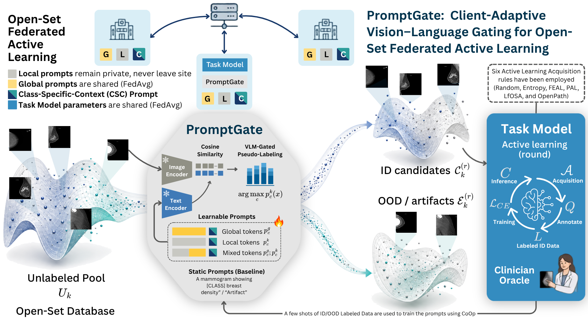

# PromptGate: Client-Adaptive Vision–Language Gating for Open-Set Federated Active Learning

This repository contains the **official PyTorch implementation** of **PromptGate**.

---

## Overview



PromptGate tackles **open-set federated active learning**, where each client holds a private unlabeled pool contaminated with out-of-distribution (OOD) samples and artifacts. The goal is to spend a limited annotation budget on in-distribution (ID) candidates while keeping client data private.

At the core is a **VLM gate** built on a frozen BiomedCLIP backbone (image + text encoders). Cosine similarity between image features and prompt embeddings yields **VLM-gated pseudo-labels** that separate the unlabeled pool into **ID candidates** and **OOD / artifacts**, so the active-learning oracle is only queried on likely-ID samples.

Gating is driven by **client-adaptive learnable prompts**, which decompose into:
- **Global tokens** — shared across clients via FedAvg.
- **Local tokens** — kept private and never leave the site.
- **Mixed tokens** — combine global and local context (with a Class-Specific-Context / CSC variant), replacing the static text-prompt baseline.

A few shots of ID/OOD labeled data tune these prompts via **CoOp**. The downstream **task model** runs each active-learning round (inference → training), and its parameters are shared via FedAvg, while a clinician oracle labels the queried ID candidates. PromptGate is agnostic to the acquisition rule and is evaluated with **Random, Entropy, FEAL, PAL, LfOSA, and OpenPath**.

---

## Requirements

### Environment Setup
We recommend using Conda:
```bash
conda env create -f environment.yml   # creates and provisions the `promptgate` env
conda activate promptgate
```

### Core Dependencies
Ensure you have the correct version of PyTorch for your CUDA environment:
```bash
# Example for CUDA 12.4
pip install torch==2.6.0+cu124 torchvision==0.21.0+cu124 torchaudio==2.6.0+cu124 --index-url https://download.pytorch.org/whl/cu124

# Install the remaining requirements
pip install -r requirements.txt
```
*Tested with Python ≥3.10, PyTorch ≥2.1, and CUDA ≥12.0.*

---

## Datasets & Attribution

PromptGate is evaluated on two benchmarks — **Fed-ISIC** (dermatology) and **Fed-EMBED** (mammography) — each with an in-distribution (ID) task and an out-of-distribution (OOD) set. **Please cite the original dataset authors when using this code.**

| Benchmark | Role | Source | Download |
|-----------|------|--------|----------|
| **Fed-ISIC** — 8-class skin-lesion classification | ID | **ISIC 2019** via **FLamby** `fed_isic2019` (HAM10000 + BCN20000 + ISIC/MSK archive) | [FLamby](https://github.com/owkin/FLamby/tree/main/flamby/datasets/fed_isic2019) · [ISIC 2019](https://challenge2019.isic-archive.com/) |
| | OOD | **Fitzpatrick17k** (clinical dermatology) and **DDI – Diverse Dermatology Images** (Stanford) | [Fitzpatrick17k](https://github.com/mattgroh/fitzpatrick17k) · [DDI](https://aimi.stanford.edu/datasets/ddi-diverse-dermatology-images) |
| **Fed-EMBED** — breast-density classification (BI-RADS A–D) | ID | **EMBED** — Emory Breast Imaging Dataset | [EMBED_Open_Data](https://github.com/Emory-HITI/EMBED_Open_Data) |
| | OOD | **Naturally present** within EMBED — radio-opaque markers / imaging artifacts; artifact labels follow **mammo-artifacts** | [mammo-artifacts](https://github.com/biomedia-mira/mammo-artifacts) |

> **⚠️ Data access.** ISIC-2019 (Fed-ISIC) is public, so its **index splits are shipped in this repo** under `data/data_split/FedISIC/`. **EMBED (Fed-EMBED) is credentialed** — you must register and accept the data-use agreement via [EMBED_Open_Data](https://github.com/Emory-HITI/EMBED_Open_Data); its metadata CSVs and features are therefore **not redistributed here**. After obtaining EMBED, place its `train.csv` / `test.csv` and the pre-extracted feature files under `data/FedEMBED/`.

### Preprocessing
The FedISIC splits used in the paper are tracked **in-repo** under [`data/data_split/FedISIC/`](data/data_split/FedISIC/) and are read via **repo-relative paths** in [`data/dataset_generator.py`](data/dataset_generator.py) — run all commands from the project root, so no machine-specific configuration is needed. Convert the raw ISIC images to `.npy` with `python data/prepare_dataset.py`. **Fed-EMBED** instead reads the credentialed EMBED metadata + features from `data/FedEMBED/` (see the data-access note above).

### Out-of-Distribution (OOD) setup
Each client's unlabeled pool is contaminated with OOD samples that the VLM gate must filter out before the oracle is queried. The two benchmarks source OOD differently.

**Fed-ISIC** — the `--ood` flag selects a split CSV under `data/data_split/FedISIC/`:

| `--ood` | Split CSV | Content |
|---------|-----------|---------|
| `ID`  | `train_test_split.csv`                      | ISIC-2019 in-distribution only |
| `50%` | `realistic_train_test_split_far_ood_50.csv` | ISIC-2019 ID + 50% **Far-OOD** (Fitzpatrick17k / DDI) |

Within a split CSV, OOD rows have `target >= 8`; they are assigned `train_label = -1` (excluded from supervision) and are exactly what the VLM gate must discard.

**Fed-EMBED** — has **no `data_split` CSV**; its OOD is **naturally present** in the EMBED metadata (`data/FedEMBED/{train,test}.csv`). Exams with `DENSITY >= 4` are radio-opaque markers / imaging artifacts (mapped to the artifact class, `is_ood = 1`), while `DENSITY 0–3` are the in-distribution BI-RADS density classes. `--ood ID` drops the artifacts (strict ID); any other value keeps them **at their natural rate** — so `--ood 50%` here simply means "keep the naturally-present artifacts," not a 50 % subsample.

---

## Usage

The single entry point is **`main.py`**. The exact commands used for every reported result are in [`bash/`](bash/) (`bash/all/`).

### Running an Experiment (canonical FedISIC command)
```bash
CUDA_VISIBLE_DEVICES=0 python main.py \
  --dataset FedISIC \
  --al_method Random \
  --budget 500 \
  --max_round 15 \
  --al_round 5 \
  --ood 50% \
  --base_lr 5e-4 \
  --mixed_precision \
  --deterministic \
  --warmup biomedclip_random \
  --filter_strategy vlm_only \
  --vlm_filter --vlm_eval \
  --explore_ratio 0.0 \
  --seed 0 \
  --logs_folder logs/FedISIC
```

**Reproduced settings.** FedISIC = 15 FL rounds × 5 AL rounds (`base_lr 5e-4`); FedEMBED = 50 FL rounds × 10 AL rounds (`base_lr 3e-4`); budget 500; 50% OOD; seeds `{0, 1, 42}`. AL methods: `Random, Entropy, FEAL, PAL, LfOSA, OpenPath`. The VLM prompt-gating variants (`mixed`, `global`, `local`) are produced by the corresponding scripts in `bash/all/`.

> [!TIP]
> CLI arguments and method presets (`METHOD_CONFIGS`) live in `settings/config.py`; dataset paths are repo-relative inside the `data/` layer.

---

## Repository Structure

- **`main.py`**: Entry point. Parses CLI args, applies the method preset, configures the VLM filter/adapter, instantiates per-client datasets/models, and hands control to the active-learning loop.
- **`data/`**: Data layer.
  - `dataset_generator.py`: FedISIC / FedEMBED dataset construction with OOD flags and VLM metadata.
  - `metrics.py`: Query Precision (QP) and Accumulated Query Recall (AQR) utilities.
  - `data_helpers.py`, `sampler.py`: seeded samplers and dataloader helpers (reproducible batching).
  - `vlm_processor.py`: VLM probability / feature-cache utilities.
- **`training/active_learning_loop.py`**: The full AL+FL loop — per-round model (re)init, federated training/aggregation, querying, and VLM adapter updates.
- **`settings/config.py`**: CLI argument parsing and method-specific defaults (`METHOD_CONFIGS`).
- **`utils/`**:
  - `vlm_filter.py`: CLIP/BiomedCLIP tokenization, feature caching, and adapter management.
  - `cls/`: Selection methods (`selection_methods.py`) and training logic (`train_fedavg.py`).
- **`visualization/`**: `visualizer.py` auto-generates the per-run plots; `plot_results.py`, `plot_shots.py`, `plot_vlm_test_metrics.py`, `coop_plots.py` are standalone cross-experiment analysis scripts.

---

## Evaluation & Visualization
Results are logged under `logs/<DATASET>/<METHOD>/seed_<SEED>/<TIMESTAMP>/`. At the end of a run, `visualization/visualizer.py` generates global learning curves (Accuracy / Balanced Accuracy), metric trajectories (Precision, Recall, F1, AUC), and ID-Purity plots.

---

## Citation
```bibtex
@article{nesturi2026promptgate,
  title={PromptGate: Client Adaptive Vision Language Gating for Open Set Federated Active Learning},
  author={Nesturi, Adea and Due{\~n}as Gaviria, David and Zeng, Jiajun and Albarqouni, Shadi},
  journal={arXiv preprint arXiv:2603.07163},
  year={2026}
}
```

---

## License
Released under the **MIT License** — see [`LICENSE`](LICENSE).

---

## Acknowledgments
This codebase builds upon and extends prior work from:
- [FEAL](https://github.com/JiayiChen815/FEAL) | [PAL](https://github.com/njustkmg/PAL) | [LfOSA](https://github.com/ningkp/LfOSA) | [OpenPath](https://github.com/HiLab-git/OpenPath)
- [FedDG](https://github.com/liuquande/FedDG-ELCFS) | [FedLC](https://github.com/jcwang123/FedLC) | [EDL](https://github.com/dougbrion/pytorch-classification-uncertainty) | [CoOp](https://github.com/KaiyangZhou/CoOp)

Special thanks to the authors for their contributions to the community.
